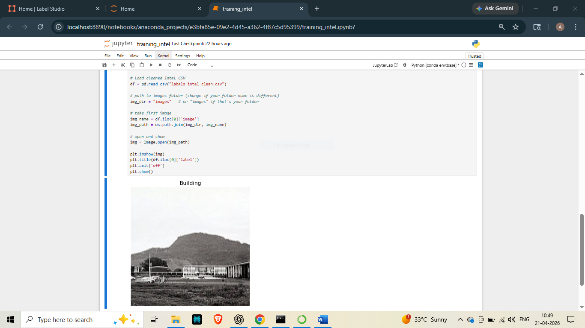

# Intel Image Classification Project

## Overview
This project is based on the Intel Image Classification dataset. 

The goal was to understand how image datasets are structured and how to prepare annotation data for machine learning tasks.

---

## What I did
- Worked with the Intel image dataset
- Processed annotation data using Python
- Converted raw JSON data into a structured CSV file
- Cleaned file paths and labels
- Verified that images and labels match correctly

---

## Project structure
- labels_intel_clean.csv → final labels file  
- training_intel.ipynb → notebook used for processing  
- sample_intel.png → example output  

---

## Tools used
- Python  
- Jupyter Notebook  

---

## Sample Output

---

## Note
The full dataset is not included in this repository due to size limitations.

---

## Next steps
- Train a simple image classification model using this dataset
- Improve dataset quality and add more samples